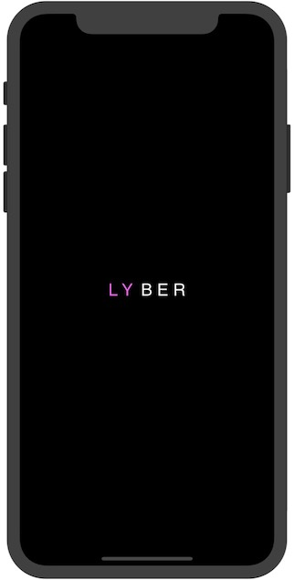
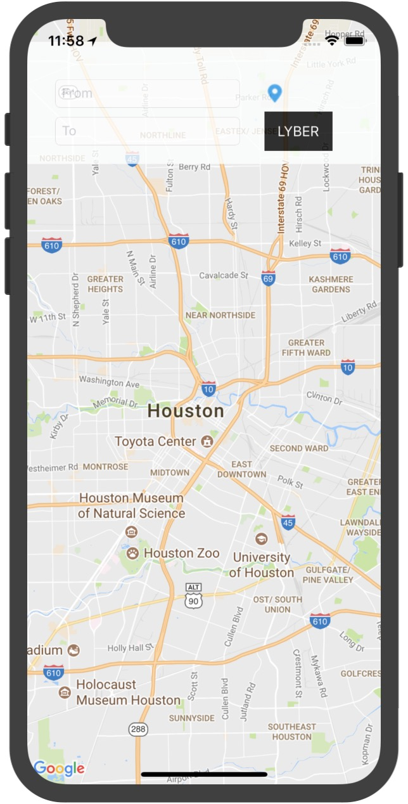
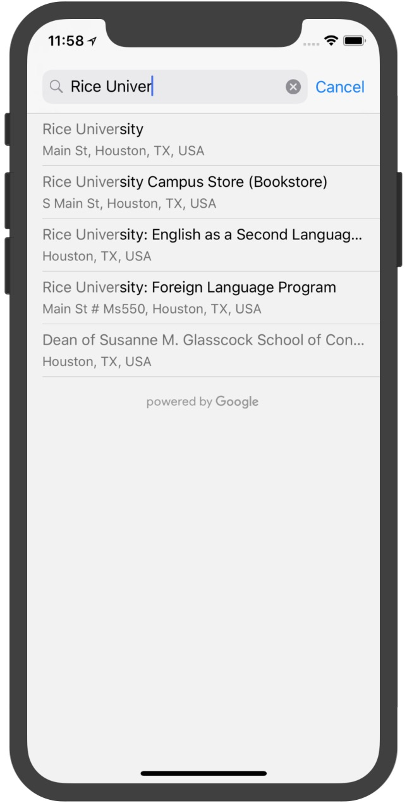
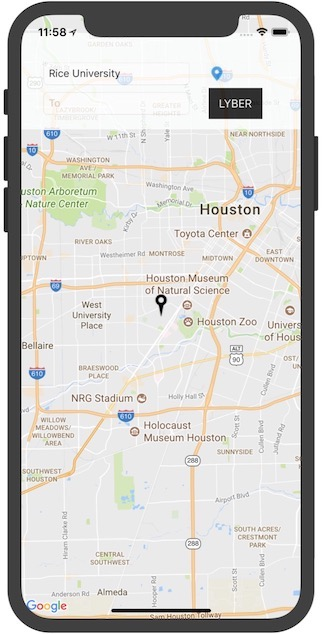
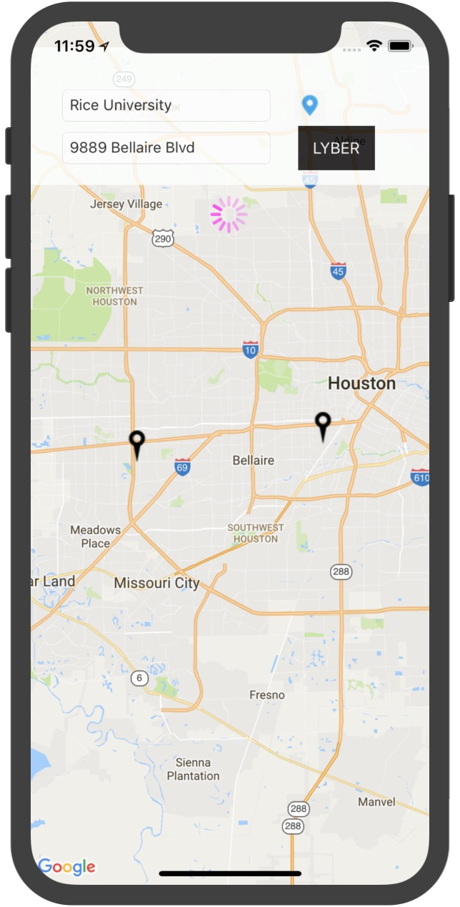
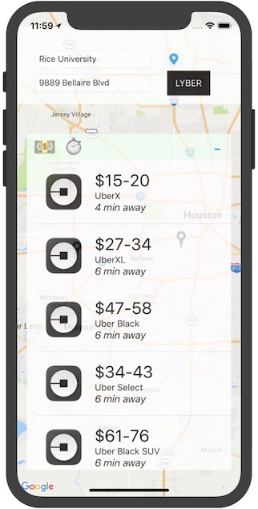
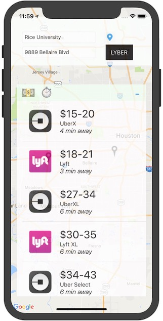
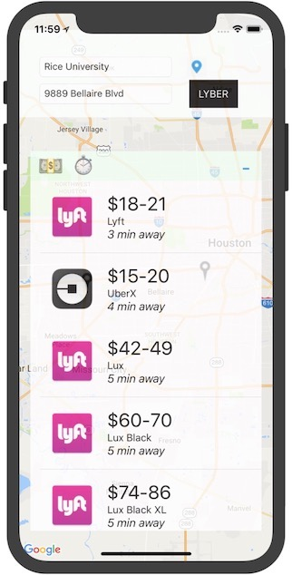
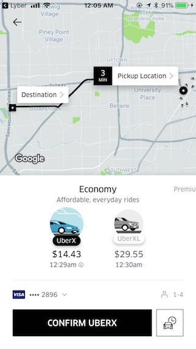

# Lyber-ios
The ios app that does fare estimation, waiting time estimation, availability estimation between Lyft and Uber. 
Co-authored by Edward Feng and Terrence Liu.
The web version of this app can be found here: https://github.com/terrenceliu/Lyber

## Getting started

```
To clone the repo, open your terminal and type: git clone https://github.com/EdwardFeng523/Lyber-ios-.git
```

### Prerequisite

```
Having the latest version of XCode installed on your machine.
```

### Run

```
Open the project using XCode. You can either run it on the simulator through XCode, or install it to a 
connected mobile device and run it on the device.
```

### Demo

```
Open up the app see the launch screen.
```

```
The main view of this app
```

```
By clicking the from/to button you can enter a new view offered by google map autocomplete api
```

```
Here we set the departure place to be Rice University.
```

```
By cliking the LYBER button, we see a table of all options.
```


```
We can sort the options based on price by clicking the dollar button.
```

```
Also we can sort based on waiting time by clicking the clock button.
```

```
After we choose the one we want to take, we press the table cell and it will direct us into the
corresponding uber/lyft app with all options already set as defined in Lyber.
```

