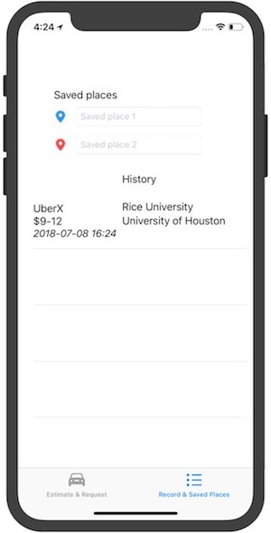
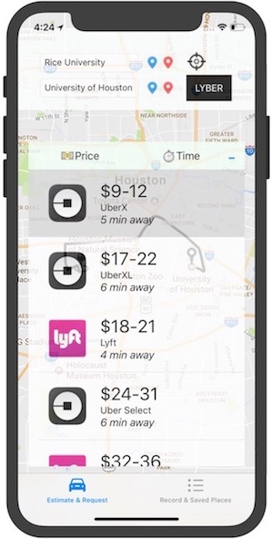

# Lyber-ios
The ios app that does fare estimation, waiting time estimation, availability estimation between Lyft and Uber. 
Co-authored by Edward Feng and Terrence Liu.
The web version of this app can be found here: https://github.com/terrenceliu/Lyber
The backend server of this app can be found here: https://github.com/terrenceliu/Lyber-express

## About
Right now this app supports price range estimate, sorting by both price and waiting time, saving your common locations, and
logging your previous requests. We've built a database on the backend server to store data about each request and estimate our
users made, and we hope to push this app forward into a data science project by generating value with the data that we have.

## Todo

-  Precise price estimate (now it only supports price range)

- Surge charge alert

- Apply personal Promo

- Display price history


## Getting started

```
To clone the repo, open your terminal and type: git clone https://github.com/EdwardFeng523/Lyber-ios-.git
```

### Prerequisite

```
Having the latest version of XCode installed on your machine.
```

### Run

```
Open the project using XCode. You can either run it on the simulator through XCode, or install it to a 
connected mobile device and run it on the device. Before running, you might need to change the bundle id and team to fit your specific device.
```

### Demo

```
Open up the app see the launch screen.
```

```
The main view of this app. The black target button on top sets the from location to your current
location. The red and blue markers are the stored locations which you can set in the Record & 
Saved Places tab on the bottom of the screen.
```

```
The Record & Saved Places tab.
```


```
Back to the main view, by clicking the from/to button you can enter a new view offered by google
map autocomplete api
```

```
After setting the from and to locations, we will see a route being drawed on the map. The app
also supports long pressing on the departure marker to drag it to the desired pickup location.
```

```
By cliking the LYBER button, we see a table of all options and we can sort them based on price
or time.
```

```
After we choose the one we want to take, we press the table cell and it will direct us into the
corresponding uber/lyft app with all options already set as defined in Lyber.
```

