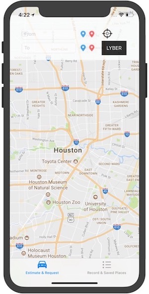
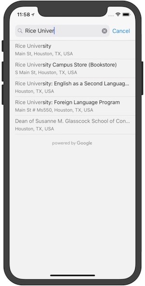
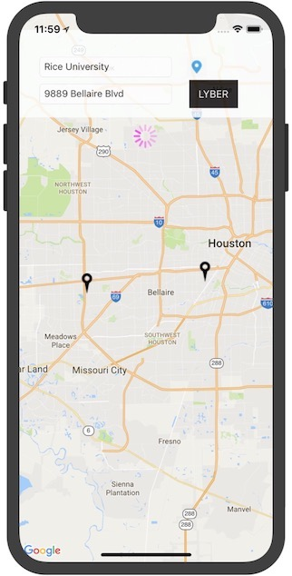
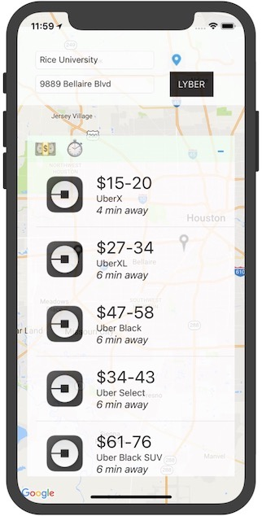

# Lyber-ios
The ios app that does fare estimation, waiting time estimation, availability estimation between Lyft and Uber. 
Co-authored by Edward Feng and Terrence Liu.
The web version of this app can be found here: https://github.com/terrenceliu/Lyber

## Getting started

```
To clone the repo, open your terminal and type: git clone https://github.com/EdwardFeng523/Lyber-ios-.git
```

### Prerequisite

```
Having the latest version of XCode installed on your machine.
```

### Run

```
Open the project using XCode. You can either run it on the simulator through XCode, or install it to a 
connected mobile device and run it on the device.
```









